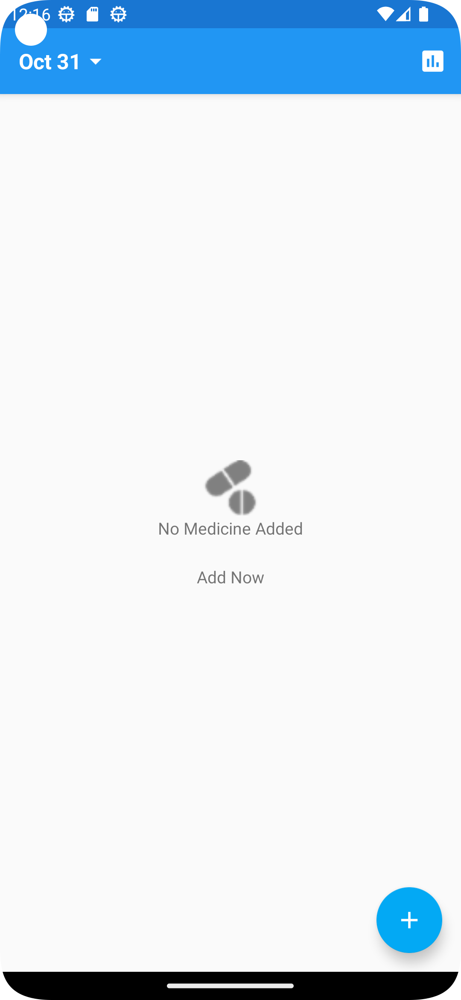
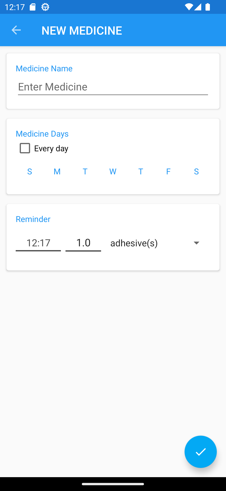

# Medicine Reminder (Android)

Simple Android app to add medicines and get reminder notifications.

**Stack:** Android (Java), AndroidX, Material, Compact Calendar, ButterKnife

## Build (Android Studio Dolphin)
- Gradle Plugin: 7.2.2
- Gradle: 7.3.3
- JDK: 11
- compileSdk/targetSdk: 33
- minSdk: 21

## How to run
1. Open in Android Studio
2. Select `prodDebug`
3. Run on emulator (API 33)

## Notes
- Android 12+ requires `android:exported` on activities with intent-filters (already set).
- Package renamed to `com.falcon.medicinetime`.

## Roadmap
- Migrate ButterKnife → ViewBinding (already enabled)
- Add WorkManager-based reminder scheduling
- Dark theme + Material3
- Notification actions: Snooze / Mark taken
- Unit tests for reminder logic

## Screenshots
 

